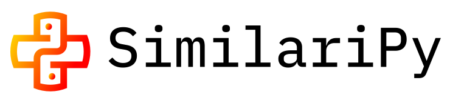

# 

## Welcome to SimilariPy’s documentation!

**SimilariPy** is a Python package that provides high-performance KNN similarity and normalization functions, optimized for sparse matrices.

---

## 🔥 Why SimilariPy?

- **Fast**: powered by Cython and OpenMP for fast parallel execution
- **Sparse matrix focus**: optimized for Scipy CSR/COO formats
- **Wide similarity coverage**: Dot Product, Cosine, Tversky, P3α, RP3β, and more
- **Flexible normalization**: includes L1, L2, TF-IDF, BM25, BM25+

---

## 📚 Guide

- [Installation instructions](installation.md)
- [Quickstart guide](guide.md)
- [Quick reference to similarity functions](similarity.md)
- [Quick reference to normalization functions](normalization.md)
- [Full API documentation](api/similarity.md)

---

## ⚡ Key Performance Optimizations

SimilariPy achieves high performance through several key optimizations:

- **Cython compilation**: Core algorithms compiled to C++ for native-speed execution
- **OpenMP parallelization**: Multi-threaded execution scales with available CPU cores
- **GIL-free computation**: Releases Python's Global Interpreter Lock during heavy computation
- **CSR-optimized**: Direct memory access patterns optimized for Compressed Sparse Row format
- **Cache-friendly data structures**: Sequential vector storage for hot-path accumulators ensures optimal CPU cache utilization and memory bandwidth
- **Pre-allocated buffers**: Reuses row buffers across iterations, eliminating millions of allocations per computation
- **Float32 precision**: Uses 32-bit floats for matrix values instead of 64-bit for 2× memory bandwidth and better SIMD vectorization
- **Fused types**: Single codebase supports both int32/int64 matrix indices without overhead or code duplication
- **Top-K filtering**: Early termination and efficient heap structures minimize unnecessary computation

---

